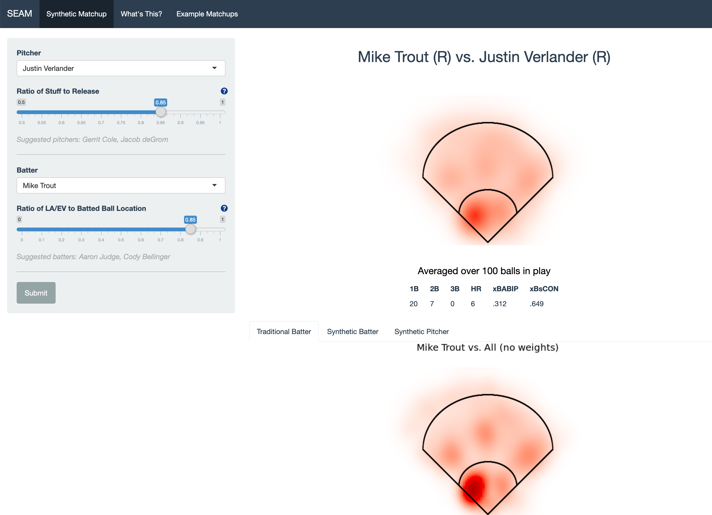

<meta name="viewport" content="width=device-width, initial-scale=1">
  <link rel="stylesheet" href="github-markdown.css">
    <style>
    .markdown-body {
      box-sizing: border-box;
      min-width: 200px;
      max-width: 980px;
      margin: 0 auto;
      padding: 45px;
    }

  @media (max-width: 767px) {
    .markdown-body {
      padding: 15px;
    }
  }
  </style>
  <article class="markdown-body">

# SEAM methodology for context-rich player matchup evaluations

```{r setup, include=FALSE}
knitr::opts_chunk$set(echo = TRUE)
```

[](https://seam.stat.illinois.edu/app/)

> The SEAM (**s**ynthetic **e**stimated **a**verage **m**atchup) app allows users to visualize synthetic spray chart distributions (batted-ball distributions) for any MLB batter-pitcher matchup that has occurred or could have occurred in the last five years.

## Information

- [**Shiny App**](https://seam.stat.illinois.edu/app/) [ [Source @ GitHub](https://github.com/cdyoung/seam/) ]
- [Article Preprint](https://publish.illinois.edu/danieleck/files/2020/05/spray.pdf)
<!-- - [Fangraphs Article]() -->

## Authors

- [Charlie Young](https://twitter.com/youngcharles02)
  - Director of Analytics, Illini Baseball
  - Quantitative Developer, Houston Astros
- [David Dalpiaz](https://daviddalpiaz.org/)
  - Assistant Teaching Professor, Department of Statistics @ Illinois
- [Daniel Eck](https://publish.illinois.edu/danieleck/)
  - Assistant Professor, Department of Statistics @ Illinois

## Acknowledgments

This work is supported by:

- [ATLAS Infrastructure](https://atlas.illinois.edu/)
- [Illini Analytics](https://sabermetrics.cs.illinois.edu/)

This work was improved by helpful comments and feedback from:

- [Alan Nathan](http://baseball.physics.illinois.edu/)
- [Jim Albert](http://www-math.bgsu.edu/~albert/)
- [James Balamuta](https://www.thecoatlessprofessor.com/)
- [John Marden](http://www.stat.istics.net/)
- [Dootika Vats](http://home.iitk.ac.in/~dootika/)
- [Dave Zhao](https://stat.illinois.edu/directory/profile/sdzhao)

</article>
